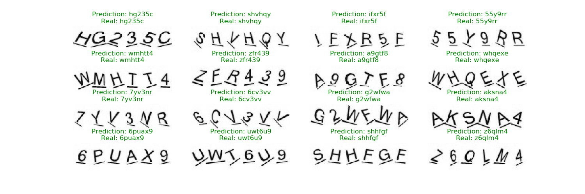

# captcha-breaker

## Download dataset

Download 10,000 captcha images with most of duplicates removed.
```bash
python3 download.py
```

## Train the model (or run it)

```bash
python3 train.py
```

Training reports 4 metrics for each epoch:
1. `loss` - CTC loss
2. `CER` - character error rate - the percentage of incorrectly annotated characters
3. `WER` - word error rate - the percentage of incorrectly annotated captchas
  * if all characters are correct then the captcha is correct

## Run the model through dataset

Automatically annotates unannotated captchas in `./dataset`.

```bash
python3 run.py
```

Use those annotations to cut (or copy and remove) correct annotations to `./temp_dataset`
and fix wrong ones and copy to `./temp_dataset` (without removing them from `./dataset`)

## Current best results



Current model results:
```
loss: 0.1101 - CER: 0.0041 - WER: 0.0239 - val_loss: 0.0743 - val_CER: 0.0010 - val_WER: 0.0059
```
